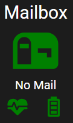

# Adeunis-Dry-Contacts-Mailbox-LoRaWAN

This project utilizes a high-quality Adeunis Dry Contacts device, specifically designed for outdoor durability (IP68) as well as low power consumption and long battery life. Adeunis provides a straightforward yet efficient mobile application for configuring basic parameters such as `APP_EUI`, `APP_KEK`, and the behavior of the Dry Contacts. For more advanced LoRaWAN settings, you can communicate with the device using AT Commands.

Each Dry Contacts unit can operate in either event mode or periodic mode. In event mode, the device sends a data frame as soon as an event is triggered, adhering to the fair use policy. Conversely, in periodic mode, it counts events across all interfaces during a predefined time frame and transmits the data.

In other words, this module gathers all the requirements I need for this project.

## Table of Contents

- [Adeunis-Dry-Contacts-Mailbox-LoRaWAN](#adeunis-dry-contacts-mailbox-lorawan)
  - [Table of Contents](#table-of-contents)
  - [Architecture Schema](#architecture-schema)
  - [Electic Schema](#electic-schema)
  - [Configuration](#configuration)
    - [Helium Console](#helium-console)
      - [Register the device](#register-the-device)
      - [Decoder Function](#decoder-function)
      - [Flows](#flows)
    - [Adeunis Dry Contacts V1](#adeunis-dry-contacts-v1)
      - [Network Settings](#network-settings)
      - [Application Settings](#application-settings)
    - [AWS](#aws)
      - [IoT Rule](#iot-rule)
  - [Home Assistant](#home-assistant)
    - [Node-Red](#node-red)
      - [Dry Contacts Data - Frame 0x40](#dry-contacts-data---frame-0x40)
      - [Keep Alive - Frame 0x30](#keep-alive---frame-0x30)
    - [Dashboard](#dashboard)
  - [3D Printer support](#3d-printer-support)
    - [V2 Magnetic Holder (by @steuerzentrale)](#v2-magnetic-holder-by-steuerzentrale)
  - [References](#references)

## Architecture Schema


This architecure can be described like this :

- Helium Gateway and Data Retrieval:

  - A Helium Gateway collects data frames from connected devices. These gateways use the LongFi network, which combines the LoRaWAN wireless protocol with Helium Blockchain. This allows any LoRaWAN-compatible device to transfer data.
  - It then forwards these frames to  the respective Helium accounts associated with each device.

- Data Decoding and AWS Integration:
  
  - In the Helium console, the received data frames are decoded. This process converts the raw data into a JSON format.
  - The decoded data is then forwarded to AWS IoT Core using an MQTT Integration between Helium and your AWS Account.

- MQTT Topic and MQTT Bridge:

  - Within AWS IoT Core, a rule is configured to route incoming messages to a specific MQTT topic.
  - This MQTT Topic is consumed by an MQTT Bridge, which is hosted on your on-premises Home Assistant. The MQTT Bridge acts as a bridge between the cloud-based AWS IoT Core and your local Home Assistant setup.

- Node-RED Flow and Custom Logic:
  
  - Finally, the messages received by the MQTT Bridge are processed by a Node-RED Flow.
  - The Node-RED Flow analyzes each data frame and performs custom logic based on your specific requirements. In my own projects, I send notifications via SMS and Telegram, announce events using Text-to-Speech through Alexa, and update certain entities to visualize them on a custom button in Home Assistant.

This architecture allows you to collect, decode, and process data from connected devices using Helium, AWS IoT Core, MQTT, and Node-RED.

## Electic Schema

Two `normally closed` reed switches are used to detect if a door has been opened. The magnets attached to the doors keep the switches open when the doors are closed. When a door is opened, the respective switch closes the circuit, and the rising signal wakes up the device that sends the event to the LoRaWAN Gateway. The unit TOR 1 is used for the flip door, and the TOR 2 is used for the main door.


## Configuration

### Helium Console

#### Register the device

First, you need to add a new device to your Helium account. Then, override the `Device EUI` value with the number printed on the label of the device casing. You will have to wait for your device to be recorded into the blockchain before attempting to join the network. This operation can take up to 20 minutes.

#### Decoder Function

Adeunis provides [JavaScript libraries](https://codec-adeunis.com/download) to decode all raw data in JSON format for all of these products. A simple adaptation was needed to be compatible with Helium's [JavaScript decoder function](https://github.com/vhuynen/Adeunis-Dry-Contacts-Mailbox-LoRaWAN/blob/main/source/decoder/decoder.js).

Moreover, an online tool allows you to decode the raw data: [Codec Adeunis Decoder](https://codec-adeunis.com/decoder) 🚀

#### Flows

You will need to forward the data from the mailbox to [AWS Integration](https://docs.helium.com/console/integrations/aws-iot-core/).


### Adeunis Dry Contacts V1

#### Network Settings

Configuring the device is straightforward. The IoT Configurator tool from Adeunis simplifies the process of setting up essential network parameters for joining the LoRa network. Here are the steps:

- Connect the transmitter via USB to the IoT Configurator application.
- Access the ‘Network Configuration’ menu within the tool.
- Set the mode of activation at `OTAA`.
- Set the `APP_EUI` and `APP_KEY` properties provided by the Helium console.
- Save the configuration.
- Unplug the USB cable.
- The device will then attempt to join the network.

For the remaining network settings, I have enabled ADR (Adaptive Data Rate) and set the duty cycle to ON.

❗ Unfortunately, it is not possible to change the Spread Factor (SF) because, by design, the property is read-only.

#### Application Settings

Below, the details of the application's principal registers:

| Register | Description | Value | Comment |
|:---------------|:-----------------|:--------------|:--------------|
|S300|Transmission period of the Keep Alive frame|144|144 x 10min = 1444min (Every 24 hours)|
|S306|Global operation|1|PRODUCTION MODE|
|S320|Input TOR1 configuration|0x34|- Event mode<br>- Detection of high edges only<br>- Debounce period of 50ms|
|S321|Input TOR2 configuration|0x34|- Event mode<br>- Detection of high edges only<br>- Debounce period of 50ms|
|S322|Input TOR3 configuration|0x00|Disabled|
|S323|Input TOR4 configuration|0x00|Disabled|

The I/O interfaces TOR1 and TOR2 are configured to transmit a data frame when the signal rises, with a debounce period of 50 ms.

### AWS

In order to retrieve data from Helium to Home Assistant through an MQTT Bridge with AWS IoT Core, I advise you to read this post that I wrote a while ago : [Helium-Network-AWS-IoT-Core-Home-Assistant](https://github.com/vhuynen/Helium-Network-AWS-IoT-Core-Home-Assistant).

#### IoT Rule

It will be necessary to add a [rule](https://github.com/vhuynen/Helium-Network-AWS-IoT-Core-Home-Assistant?tab=readme-ov-file#rules) to republish messages from Helium to Home Assistant through the MQTT Bridge :

- First, select all content from Helium :

``` sql
SELECT * FROM 'topic/gateway' where dev_eui = '0018BXXXXXXXXXXX'
```

- Finnaly, repost the message in the Topic dedicated to the mailbox :

`arn:aws:iot:<region>:<account>:thing/Home_Assistant/outdoor/mailbox`

## Home Assistant

Four [entities](./source/Home%20Assistant/configuration.yaml) have been added to handle the mailbox behavior within Home Assistant. :

|Name|Type|Comment|
|:---------------|:-----------------|:--------------|
|mailbox_present|input_boolean|`true` if a letter or parcel has been delivered, `false` when the mailbox has been emptied.|
|mailbox_arrived|input_datetime|The current datetime is recorded when something is deposited in the mailbox.|
|mailbox_keep_alive|input_boolean|The entity is set to `true` when a keep-alive frame is received.|
|mailbox_status|input_boolean|The entity is set to `false` when a hardware or low battery issue has been detected.|

### Node-Red

Each data frame retrieved from Helium via IoT Core is performed by a specific [Node-Red flow](./source/Node-Red/mailbox-node-red-flow.json). You can customize the flow according to your own needs.


#### Dry Contacts Data - Frame 0x40

The join-wait node allows detection of whether the flip door and the main door have been opened successively. The join-wait node waits for 60 seconds each time it receives a message. If it receives two different messages within 60 seconds, it is likely that you have emptied your mailbox. If the countdown expires, then you have received a letter or a parcel.

Based on the output of the join-wait node, the flow updates the state of the `mailbox_present` entity (true or false) and the timestamp of the `mailbox_arrived` entity if you have received something. Afterward, a Telegram message is sent to notify you of what is going on.

#### Keep Alive - Frame 0x30

The Dry contact is configured to send a healty report at Home Assistant every 24 hours (1440 mins) :

- When a frame is received, the `mailbox_keep_alive` entity is set to `true`, and a countdown of 1438 minutes is triggered to set the entity to `false` just a few minutes before the next Keep Alive frame. This allows us to detect if the module is still alive. This tip allows for updating the entity every day, as Home Assistant doesn’t update the last_changed attribute of the entity if the state remains the same.

- When a the frame is received, the `mailbox_status` entity is set to `false`. If the payload contains any issues (hardware or low battery), then the entity is set to `true` indicating trouble with the module. If an issue is detected, a health report is sent via Telegram.

### Dashboard

A [custom button](./source/Home%20Assistant/mailbox-custom-button.yaml) allows you to quickly view the state of the mailbox. The heart pulse icon allows you to check that the module is still functioning since the last 24 hours, and the battery icon allows you to verify that there are no hardware or battery issues.

Below, the visual of the custom button :

|No Mail|Mail Arrived|
|:---------------|:-----------------|
|||

## 3D Printer support

To avoid drilling holes in the mailbox, two magnetic supports are available :

- One for the [Dry Contacts V1](./source/3D%20Printer/Dry%20Contacts%20V1/Dry_Contacts_Holder_V1.stl) 
- Another for the [Dry Contacts V2](./source/3D%20Printer/Dry%20Contacts%20V2/Dry_Contacts_Holder_V2.stl)

🙏 A special big thanks to @steuerzentrale for the beautiful and highly practical V2 magnetic holder.
His contribution significantly improves the mounting experience and overall usability of the project.

### V2 Magnetic Holder (by @steuerzentrale)


## References

- Official Adeunis Dry Contact user guide : [User Guide DRY CONTACTS V1.2.0](https://adeunis.freshdesk.com/en/support/solutions/articles/22000242785-user-guide-dry-contacts-v1-2-0)
- Download LoRaWAN [User Guide DRY CONTACTS V1.2.0](https://adeunis.freshdesk.com/helpdesk/attachments/22041357409)

If you appreciate this project, please don’t hesitate to star ⭐ it and feel free to provide your feedback !